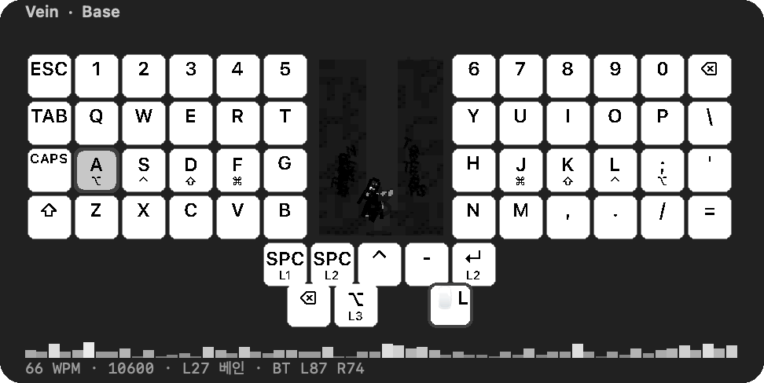
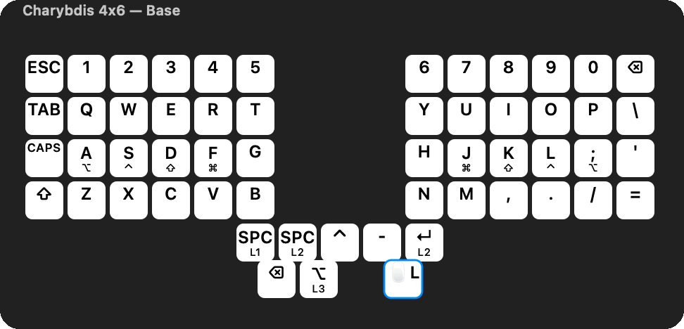
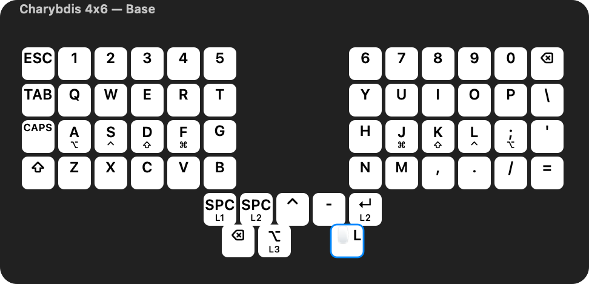
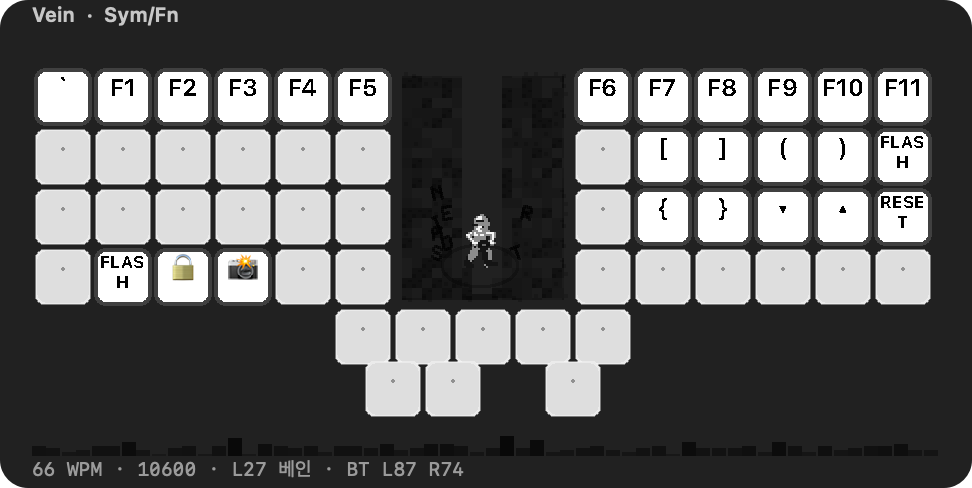
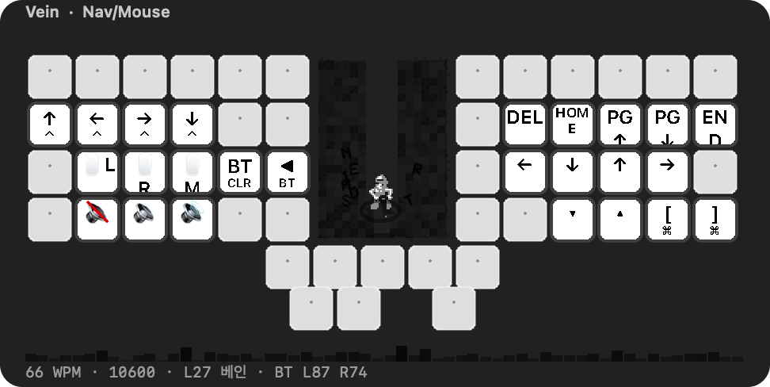
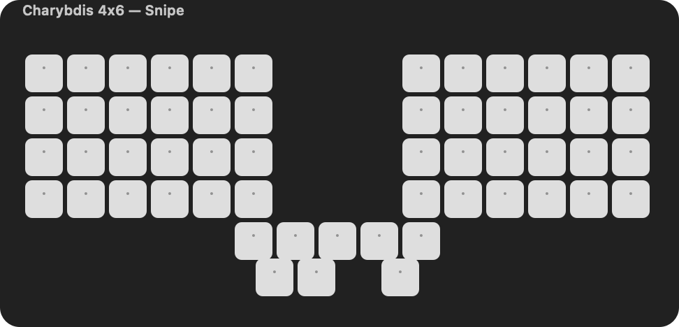
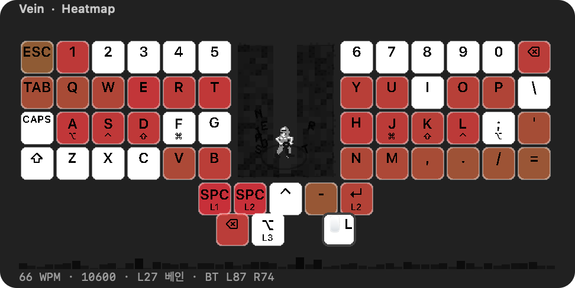
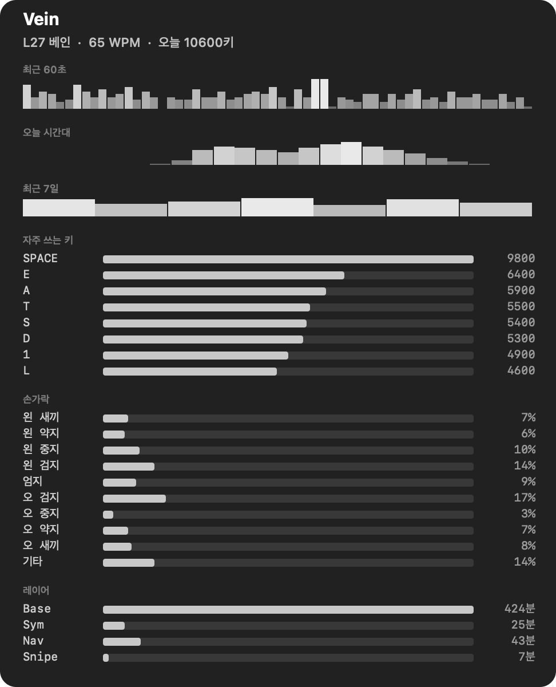

<div align="center">

# Vein

ZMK keymap overlay for macOS. Reads your `.keymap`. Lights up as you type.

[](https://swift.org)
[](https://www.apple.com/macos)
[](LICENSE)

</div>





| | |
|---|---|
|  |  |
|  |  |





Parses the firmware `.keymap` directly — save the file, the overlay reloads. Digging follows keystrokes. Menu bar: left-click toggles the overlay, right-click for heatmap / learning mode / miner·mole·cart.

`⌘⌃K` overlay · `⌘⌃S` stats

## Install

Needs macOS 12+ and `swiftc` (Xcode Command Line Tools).

```bash
git clone https://github.com/midagedev/zmk-overlay
cd zmk-overlay
./build.sh
open build/KeymapOverlay.app
```

Then System Settings → Privacy & Security → Accessibility → add **Vein**.  
`build.sh` signs with your Apple Development identity when it can, so that grant survives rebuilds.

```bash
defaults write com.midagedev.KeymapOverlay keymapPath /path/to/your.keymap
```

If unset, looks for a sibling [zmk-config-charybdis](https://github.com/midagedev/zmk-config-charybdis) checkout.

Share a keymap image: `build/KeymapOverlay.app/Contents/MacOS/KeymapOverlay --export-assets ~/Desktop --demo`

## Layer sentinels

A layer hold is invisible to the host. To show it live:

```dts
l1_signal: l1_signal {
    compatible = "zmk,behavior-macro";
    #binding-cells = <0>;
    bindings
        = <&macro_press &mo 1 &kp F16>
        , <&macro_pause_for_release>
        , <&macro_release &mo 1 &kp F16>
        ;
};
```

F16 = 106, F17 = 64, F18 = 79. Don’t use F13/F14.

Geometry is `presets/charybdis-4x6.json`. Parser covers `&kp` `&mo` `&lt` `&mt` hold-taps macros `&bt` `&mkp` `&trans`. macOS 12+.

[MIT](LICENSE)
